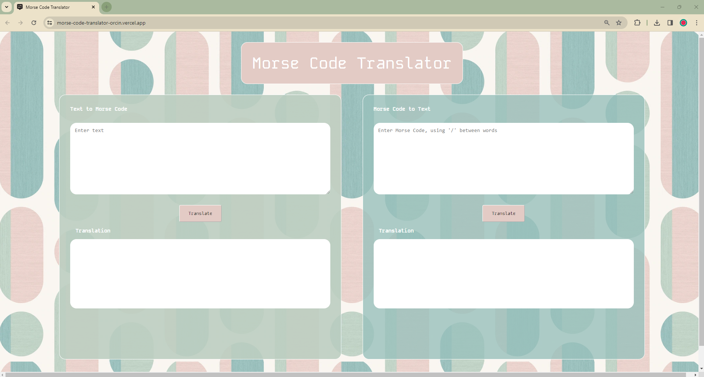

# Morse Code Translator &#x1F4AC;
A simple morse code translator web application that takes user input and translates between text and morse-code. A project to practice implementing HTML, SCSS, JavaScript and unit testing frameworks (Jest).

Deployed Link : [Morse Code Translator](https://morse-code-translator-steel.vercel.app/)

## Key Features
- Responsive HTML and SCSS design.
- Includes JS functions to translate English text to Morse and Morse to English text.
- Test-to-morse function handles all alphabet character, numbers, spaces and valid punctuations.
- Morse-to-test function takes only '-', '.' or '/' for inputs.
- Invalid inputs are handled gracefully with clear error messages generated dynamically through DOM manipulation.
- Extensive test cases written using jest to cover responses for a variety of inputs.

## TechStack and Frameworks 
HTML | SCSS | JavaScript | Jest